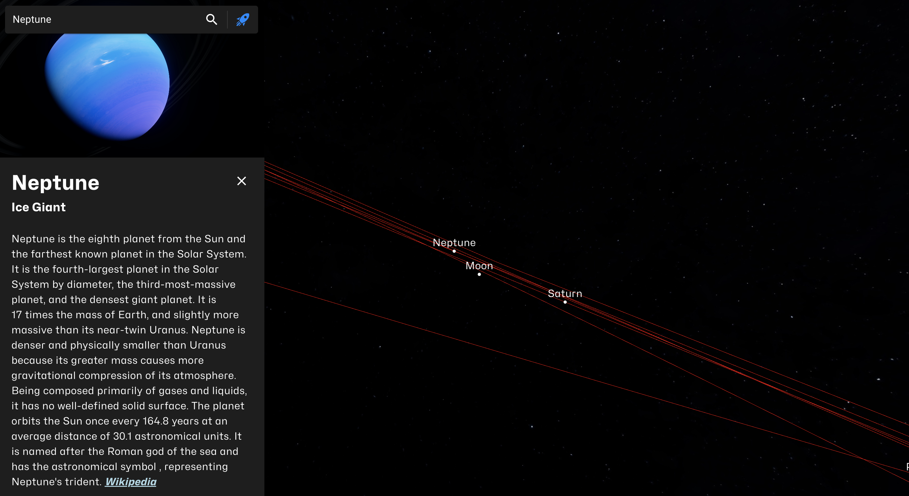
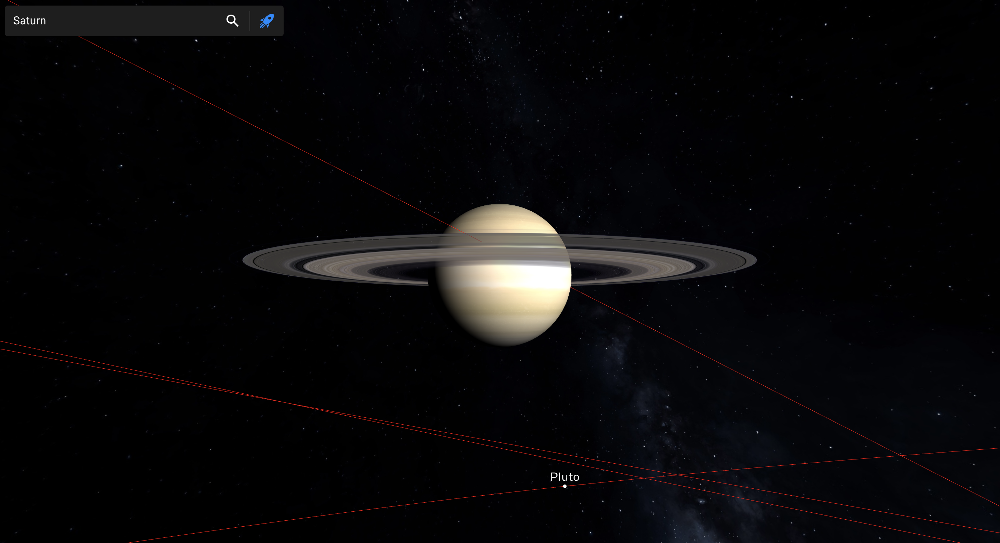
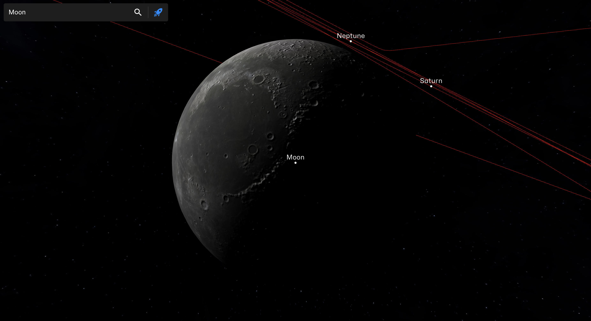
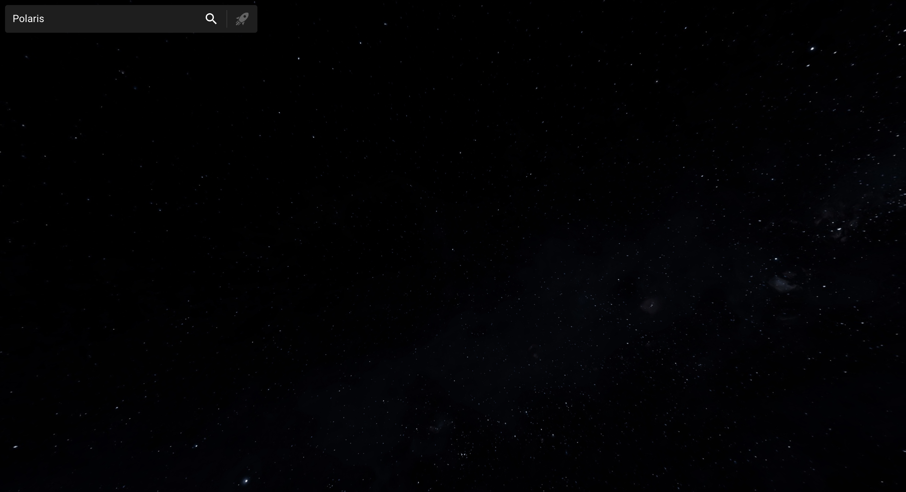
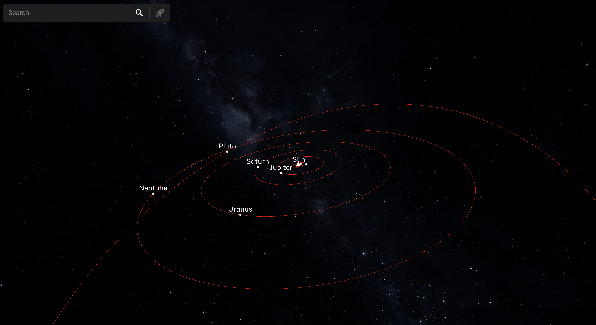

SolarSystem.3js is a stunningly realistic representation of the Solar System, complete with nearby stars, and brought to life through the power of [three.js](https://github.com/mrdoob/three.js/), [WebGL](https://github.com/KhronosGroup/WebGL), and [ReactJS](https://github.com/facebook/react).

[![Launch](https://img.shields.io/badge/-Launch_Website-00a6ff?style=for-the-badge&logo=data:image/svg+xml;base64,PD94bWwgdmVyc2lvbj0iMS4wIiBlbmNvZGluZz0iVVRGLTgiIHN0YW5kYWxvbmU9Im5vIj8+PCFET0NUWVBFIHN2ZyBQVUJMSUMgIi0vL1czQy8vRFREIFNWRyAxLjEvL0VOIiAiaHR0cDovL3d3dy53My5vcmcvR3JhcGhpY3MvU1ZHLzEuMS9EVEQvc3ZnMTEuZHRkIj48c3ZnIHdpZHRoPSIxMDAlIiBoZWlnaHQ9IjEwMCUiIHZpZXdCb3g9IjAgMCA0OCA0OCIgdmVyc2lvbj0iMS4xIiB4bWxucz0iaHR0cDovL3d3dy53My5vcmcvMjAwMC9zdmciIHhtbG5zOnhsaW5rPSJodHRwOi8vd3d3LnczLm9yZy8xOTk5L3hsaW5rIiB4bWw6c3BhY2U9InByZXNlcnZlIiB4bWxuczpzZXJpZj0iaHR0cDovL3d3dy5zZXJpZi5jb20vIiBzdHlsZT0iZmlsbC1ydWxlOmV2ZW5vZGQ7Y2xpcC1ydWxlOmV2ZW5vZGQ7c3Ryb2tlLWxpbmVqb2luOnJvdW5kO3N0cm9rZS1taXRlcmxpbWl0OjI7Ij48cGF0aCBkPSJNOS4zNSwyMC40NWw1LjMsMi4yNWMwLjYsLTEuMiAxLjI0MiwtMi4zODMgMS45MjUsLTMuNTVjMC42ODMsLTEuMTY3IDEuNDA4LC0yLjI4MyAyLjE3NSwtMy4zNWwtMy45NSwtMC44bC01LjQ1LDUuNDVabTcuNyw0LjA1bDYuNjUsNi42NWMxLjksLTAuODY3IDMuNjgzLC0xLjg1IDUuMzUsLTIuOTVjMS42NjcsLTEuMSAzLjAxNywtMi4xNjcgNC4wNSwtMy4yYzIuNywtMi43IDQuNjgzLC01LjQ2NyA1Ljk1LC04LjNjMS4yNjcsLTIuODMzIDEuOTUsLTYuMDMzIDIuMDUsLTkuNmMtMy41NjcsMC4xIC02Ljc2NywwLjc4MyAtOS42LDIuMDVjLTIuODMzLDEuMjY3IC01LjYsMy4yNSAtOC4zLDUuOTVjLTEuMDMzLDEuMDMzIC0yLjEsMi4zODMgLTMuMiw0LjA1Yy0xLjEsMS42NjcgLTIuMDgzLDMuNDUgLTIuOTUsNS4zNVptMTEuNDUsLTQuOGMtMC42NjcsLTAuNjY3IC0xLC0xLjQ5MiAtMSwtMi40NzVjMCwtMC45ODMgMC4zMzMsLTEuODA4IDEsLTIuNDc1YzAuNjY3LC0wLjY2NyAxLjQ5MiwtMSAyLjQ3NSwtMWMwLjk4MywwIDEuODA4LDAuMzMzIDIuNDc1LDFjMC42NjcsMC42NjcgMSwxLjQ5MiAxLDIuNDc1YzAsMC45ODMgLTAuMzMzLDEuODA4IC0xLDIuNDc1Yy0wLjY2NywwLjY2NyAtMS40OTIsMSAtMi40NzUsMWMtMC45ODMsMCAtMS44MDgsLTAuMzMzIC0yLjQ3NSwtMVptLTAuNzUsMTkuMTVsNS40NSwtNS40NWwtMC44LC0zLjk1Yy0xLjA2NywwLjc2NyAtMi4xODMsMS40OTIgLTMuMzUsMi4xNzVjLTEuMTY3LDAuNjgzIC0yLjM1LDEuMzI1IC0zLjU1LDEuOTI1bDIuMjUsNS4zWm0xNi4zLC0zNC43YzAuMyw0LjUzMyAtMC4yNjcsOC42NjcgLTEuNywxMi40Yy0xLjQzMywzLjczMyAtMy44LDcuMjUgLTcuMSwxMC41NWwtMC4yLDAuMmwxLjEsNS41YzAuMSwwLjUgMC4wNzUsMC45ODMgLTAuMDc1LDEuNDVjLTAuMTUsMC40NjcgLTAuNDA4LDAuODgzIC0wLjc3NSwxLjI1bC04LjU1LDguNmwtNC4yNSwtOS45bC04LjUsLTguNWwtOS45LC00LjI1bDguNiwtOC41NWMwLjM2NywtMC4zNjcgMC43ODMsLTAuNjI1IDEuMjUsLTAuNzc1YzAuNDY3LC0wLjE1IDAuOTUsLTAuMTc1IDEuNDUsLTAuMDc1bDUuNSwxLjFjMC4wMzMsLTAuMDMzIDAuMDY3LC0wLjA1OCAwLjEsLTAuMDc1YzAuMDMzLC0wLjAxNyAwLjA2NywtMC4wNDIgMC4xLC0wLjA3NWMzLjMsLTMuMyA2LjgxNywtNS42NzUgMTAuNTUsLTcuMTI1YzMuNzMzLC0xLjQ1IDcuODY3LC0yLjAyNSAxMi40LC0xLjcyNVptLTM2LjYsMjcuNmMxLjE2NywtMS4xNjcgMi41OTIsLTEuNzU4IDQuMjc1LC0xLjc3NWMxLjY4MywtMC4wMTcgMy4xMDgsMC41NTggNC4yNzUsMS43MjVjMS4xNjcsMS4xNjcgMS43NDIsMi41OTIgMS43MjUsNC4yNzVjLTAuMDE3LDEuNjgzIC0wLjYwOCwzLjEwOCAtMS43NzUsNC4yNzVjLTAuODY3LDAuODY3IC0yLjIwOCwxLjU4MyAtNC4wMjUsMi4xNWMtMS44MTcsMC41NjcgLTQuNTQyLDEuMSAtOC4xNzUsMS42YzAuNSwtMy42MzMgMS4wMjUsLTYuMzY3IDEuNTc1LC04LjJjMC41NSwtMS44MzMgMS4yNTgsLTMuMTgzIDIuMTI1LC00LjA1Wm0yLjEsMi4xNWMtMC40NjcsMC41IC0wLjg4MywxLjI4MyAtMS4yNSwyLjM1Yy0wLjM2NywxLjA2NyAtMC42ODMsMi40MzMgLTAuOTUsNC4xYzEuNjY3LC0wLjI2NyAzLjAzMywtMC41ODMgNC4xLC0wLjk1YzEuMDY3LC0wLjM2NyAxLjg1LC0wLjc4MyAyLjM1LC0xLjI1YzAuNjMzLC0wLjU2NyAwLjk1OCwtMS4yNzUgMC45NzUsLTIuMTI1YzAuMDE3LC0wLjg1IC0wLjI3NSwtMS41OTIgLTAuODc1LC0yLjIyNWMtMC42MzMsLTAuNiAtMS4zNzUsLTAuODkyIC0yLjIyNSwtMC44NzVjLTAuODUsMC4wMTcgLTEuNTU4LDAuMzQyIC0yLjEyNSwwLjk3NVoiIHN0eWxlPSJmaWxsOiNmZmY7ZmlsbC1ydWxlOm5vbnplcm87Ii8+PC9zdmc+)](https://fatih.balsoy.com/app/solar-system-3js)
[](https://github.com/fatihbalsoy/SolarSystem.3js/actions/workflows/webpack.yml)

## Gameplay

Explore the wonders of our solar system with the Planet Search feature! Discover fascinating details about each planet as you delve into their unique characteristics. By simply searching for a planet, you can access a summary of information pulled from reliable sources like Wikipedia. Additionally, the feature provides essential astronomical coordinates such as Right Ascension (RA), Declination (Dec), Azimuth, and Altitude, granting you a deeper understanding of the planet's position in the celestial sphere. Unveil the secrets of our neighboring worlds and elevate your astronomical knowledge with just a few taps.

To adjust the camera's distance, simply scroll up or down. If you want to orbit around a particular celestial object, click and drag your mouse. Additionally, you can center an object on your screen by using the search bar located at the top. For instance, you can search for celestial bodies such as the following:

<details>
<summary>Planets</summary>

* Mercury
* Venus
* Earth
* Mars
* Jupiter
* Saturn
* Uranus
* Neptune

</details>

<details>
<summary>Dwarf Planets</summary>

* Pluto
* ~~Ceres~~ (Temporarily Removed)

</details>

<details>
<summary>Moons</summary>

Earth

* Moon

Jupiter

* Europa
* Ganymede
* Io
* Callisto

</details>

<details>
<summary>Stars</summary>

* Sun
* Antares
* Polaris
* Proxima Centauri
* Rigil Kentaurus
* and lots more!

</details>

## Screenshots



|||
|-|-|
|  |  |
|  |  |

## Known Issues

Here are some known issues that will be worked on in the near future:

* Every celestial object's rotation, other than Earth and Moon, is not accurate.
* The camera is not oriented along the ecliptic plane.

## Setup & Build

[](https://github.com/fatihbalsoy/SolarSystem.3js/actions/workflows/webpack.yml)
[](https://github.com/fatihbalsoy/SolarSystem.3js/actions/workflows/calculate-orbits.yml)


Download [Node.js](https://nodejs.org/en/download/).
Run the following commands:

``` bash
# Install dependencies (only the first time)
npm install

# Run the local server at localhost:8080
npm run serve

# Build for production in the dist/ directory
npm run build:prod

# Calculate orbits and create cache file
npm run calculate-orbits

# Pull latest planet information from Wikipedia
npm run update-wiki

# Calculate orbits, update wiki, then build for production
npm run build:prod:all

# Run build:prod:all and run the local server at localhost:3000
npm run serve:prod
```

## Contribution

Feel free to submit a pull request for one of the following:

* New features
* Performance enhancements
* Fixing bugs
* Patching security vulnurabilities

## License

SolarSystem.3js is available under the AGPL v3.0 license. See the LICENSE file for more info.

## Special Thanks and Licenses

This project would not have been possible without these helpful resources:

* [Astronomy Engine by Don Cross - MIT](https://github.com/cosinekitty/astronomy)
* [HYG Star Database by David Nash - CC BY-SA 2.5](https://github.com/astronexus/HYG-Database)
* [Textures by Solar System Scope - CC BY 4.0](https://www.solarsystemscope.com/textures/)
* [Galilean Moon Textures by Stellarium - GPL v2.0](https://github.com/Stellarium/stellarium)
* [Computing Planetary Positions by Paul Schlyter](https://www.stjarnhimlen.se/comp/tutorial.html)
* [Textures by James Hastings-Trew](https://planetpixelemporium.com/planets.html)
* [Solar System Data by Christophe](https://api.le-systeme-solaire.net/en/)
* [Ephemeris Data by NASA's Horizons System](https://ssd.jpl.nasa.gov/horizons/app.html#/)
* [Monthly Earth Images by NASA](https://visibleearth.nasa.gov/collection/1484/blue-marble)
* [High-res image of Io by USGS](https://pubs.usgs.gov/sim/3168/)
* Licenses for images used in the wiki/info card can be found [here](https://github.com/fatihbalsoy/SolarSystem.3js/tree/master/src/data/generate_data.py).
